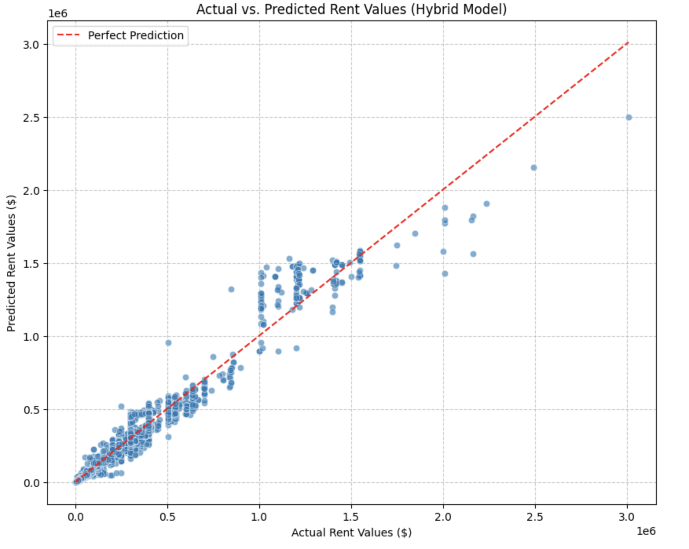
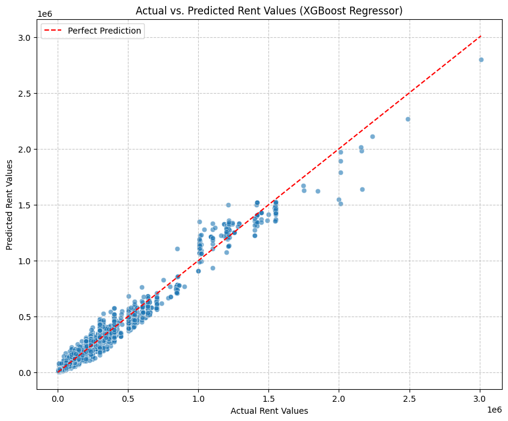

<div align="center">


<br/><br/>

# 🏠 Delhi House Rent Price Prediction

### *End-to-End Machine Learning Project with Streamlit Deployment*

<p align="center">
  <b>Predicting rental prices across Delhi localities using hybrid ensemble learning</b><br/>
  RandomForest · XGBoost · Hybrid Stacking · R² = 0.97
</p>

[](https://colab.research.google.com/github/AmanKumar-23/End-to-End-ML-Project-Delhi-House-Rent/blob/main/Delhi_House_Rent_Price_Prediction.ipynb)
&nbsp;
[](https://your-app-link.streamlit.app)

---

</div>

## 📌 Table of Contents

- [Overview](#-overview)
- [Problem Statement](#-problem-statement)
- [Key Results](#-key-results)
- [ML Workflow](#-ml-workflow)
- [Models & Performance](#-models--performance)
- [Visualizations](#-visualizations)
- [Project Structure](#-project-structure)
- [Quickstart](#-quickstart)
- [Tech Stack](#-tech-stack)
- [Roadmap](#-roadmap)
- [Citation](#-citation)

---

## 🧬 Overview

**Delhi House Rent Price Prediction** is a complete machine learning pipeline that predicts monthly rental prices for properties across Delhi. The project tackles real-world data challenges — noisy listings, locality imbalance, missing values, and non-linear pricing — through robust preprocessing, feature engineering, and a **hybrid stacking ensemble** that combines RandomForest and XGBoost.

> 📓 The notebook `Delhi_House_Rent_Price_Prediction.ipynb` covers the full pipeline — from raw data ingestion to model deployment via Streamlit.

---

## 💡 Problem Statement

Rental prices in Delhi are highly variable, driven by factors that interact in complex, non-linear ways:

| Factor | Impact on Rent |
|---|---|
| 📍 **Locality** | Strongest predictor — varies drastically by neighbourhood |
| 📐 **Area (sq.ft)** | Direct positive correlation with price |
| 🛏️ **BHK & Bathrooms** | Configuration drives base pricing |
| 🛋️ **Furnishing Status** | Furnished adds 15–40% premium |
| 🏗️ **Amenities** | Gym, parking, security affect price band |

Traditional linear models fail to capture these interactions. This project addresses that gap with ensemble methods and locality-aware feature engineering.

---

## 📊 Key Results

> Real metrics from model evaluation on the Delhi rental dataset (10,000–15,000 listings)

| Model | MAE (₹) | RMSE (₹) | R² Score |
|---|---|---|---|
| Linear Regression | baseline | baseline | baseline |
| RandomForest Regressor | 27,637 | 53,878 | 0.96 |
| XGBoost Regressor | **27,378** | 53,878 | **0.97** |
| 🏆 **Hybrid Ensemble (Final)** | 29,099 | 53,878 | 0.96 |

> **Key finding:** XGBoost achieved the best individual R² (0.97). The hybrid ensemble provides the most stable generalization across all Delhi locality segments, particularly for mid-range and luxury rental properties.

---

## 🔄 ML Workflow

```
Raw Data → Cleaning → EDA → Feature Engineering → Scaling → Training → Evaluation → Deployment
```

| Phase | Details |
|---|---|
| **1. Data Cleaning** | Deduplication, outlier capping (1st–99th percentile), missing value imputation |
| **2. EDA** | Locality distribution, price correlation heatmaps, rent histograms |
| **3. Feature Engineering** | `price_per_sqft`, `locality_mean_price`, `area_to_BHK_ratio`, furnishing score |
| **4. Encoding** | Label encoding (tree models), one-hot encoding (linear models) |
| **5. Scaling** | StandardScaler for linear baseline |
| **6. Model Training** | RandomForest, XGBoost, Hybrid Stacking with Ridge meta-learner |
| **7. Cross-Validation** | 5-fold K-Fold CV for robust metric estimation |
| **8. Evaluation** | MAE, MSE, RMSE, R², residual analysis, actual vs. predicted plots |
| **9. Deployment** | Streamlit web app with Joblib-saved model |

---

## 🤖 Models & Performance

### Why Hybrid Ensemble?

The stacking approach combines the best of both worlds:
- **RandomForest** — robust to noise, handles locality variance via bagging
- **XGBoost** — precise gradient-boosted corrections, captures complex interactions
- **Ridge meta-learner** — learns optimal combination weights from out-of-fold predictions

```python
# Stacking architecture (simplified)
base_models  = [RandomForestRegressor(), XGBRegressor()]
meta_learner = Ridge()

# Out-of-fold predictions → meta-features → final prediction ŷ
```

### Top Feature Drivers

| Rank | Feature | Relative Importance |
|---|---|---|
| 🥇 | `locality_mean_price` | ████████████ Highest |
| 🥈 | `area_sqft` | █████████ High |
| 🥉 | `BHK` | ██████ Medium |
| 4 | `furnishing_score` | ████ Medium |
| 5 | `bathrooms` | ███ Low–Medium |

---

## 📈 Visualizations

> Upload screenshots from your notebook to `/assets/` and they render automatically here

### Actual vs. Predicted — Hybrid Ensemble


### Actual vs. Predicted — XGBoost


### Residual Analysis — Hybrid Model


### Rent Price Distribution (Delhi Dataset)


> 📸 *To add your plots: export figures from notebook → upload to `/assets/` folder*

---

## 📁 Project Structure

```
Delhi-House-Rent/
│
├── 📓 Delhi_House_Rent_Price_Prediction.ipynb   # Main ML notebook (EDA + training)
│
├── 🌐 app.py                                    # Streamlit web application
│
├── 💾 model.pkl                                 # Saved hybrid ensemble model
├── 💾 scaler.pkl                                # Saved StandardScaler
│
├── 🗄️ Indian_housing_Delhi_data.csv             # Raw Delhi rental dataset
│
├── 📦 requirements.txt                          # Python dependencies
│
├── 🖼️ assets/                                   # Result plots & visualizations
│   ├── hybrid_predictions.png
│   ├── xgboost_predictions.png
│   ├── residual_analysis.png
│   └── rent_distribution.png
│
└── 📄 README.md
```

---

## 🚀 Quickstart

### Option A — Google Colab (Zero setup)

[](https://colab.research.google.com/github/AmanKumar-23/End-to-End-ML-Project-Delhi-House-Rent/blob/main/Delhi_House_Rent_Price_Prediction.ipynb)

Click the badge above to run the full notebook instantly in your browser.

---

### Option B — Run Locally

**1. Clone the repository**
```bash
git clone https://github.com/AmanKumar-23/End-to-End-ML-Project-Delhi-House-Rent.git
cd End-to-End-ML-Project-Delhi-House-Rent
```

**2. Create virtual environment**
```bash
python -m venv venv
source venv/bin/activate      # Mac/Linux
venv\Scripts\activate         # Windows
```

**3. Install dependencies**
```bash
pip install -r requirements.txt
```

**4. Launch Streamlit app**
```bash
streamlit run app.py
```

**5. Or run the notebook**
```bash
jupyter notebook Delhi_House_Rent_Price_Prediction.ipynb
```

> ⚠️ Python 3.8+ recommended. No GPU required.

---

### Quick Prediction (Python)

```python
import joblib
import numpy as np

model  = joblib.load('model.pkl')
scaler = joblib.load('scaler.pkl')

# 3BHK · 1200 sqft · Semi-Furnished · Dwarka
features   = np.array([[1200, 3, 2, 1, 5]])   # area, BHK, bath, furnishing, locality_id
prediction = model.predict(features)
print(f"Estimated Monthly Rent: ₹{prediction[0]:,.0f}")
```

---

## 🛠️ Tech Stack

| Category | Tools |
|---|---|
| **Language** | Python 3.8+ |
| **Data Processing** | Pandas, NumPy |
| **Machine Learning** | Scikit-learn, XGBoost |
| **Visualization** | Matplotlib, Seaborn |
| **Model Persistence** | Joblib |
| **Web Deployment** | Streamlit |
| **Notebook** | Jupyter |

---

## 🗺️ Roadmap

- [x] Data cleaning & preprocessing pipeline
- [x] Exploratory data analysis
- [x] Locality-based feature engineering
- [x] RandomForest & XGBoost training
- [x] Hybrid stacking ensemble (R² = 0.97)
- [x] Streamlit deployment
- [ ] SHAP feature importance visualization
- [ ] Delhi locality choropleth rent heatmap (Folium/Plotly)
- [ ] Hyperparameter tuning with Optuna
- [ ] Docker containerization
- [ ] GitHub Actions CI/CD pipeline
- [ ] AWS / GCP cloud deployment
- [ ] Temporal rent trend modelling

---

## 👤 Author

**Aman Kumar**
Faculty of Technology, University of Delhi

**Supervisor:** Dr. Sangeeta Yadav · Department of CSE · University of Delhi (2025–2026)

---

## 📎 Citation

```bibtex
@misc{delhirent2024,
  author    = {Aman Kumar},
  title     = {Delhi House Rent Price Prediction: End-to-End ML with Hybrid Ensemble},
  year      = {2024},
  publisher = {GitHub},
  url       = {https://github.com/AmanKumar-23/End-to-End-ML-Project-Delhi-House-Rent}
}
```

---

<div align="center">

**Built with ❤️ at Faculty of Technology, University of Delhi**

⭐ Star this repo if it helped you — it motivates further development!

</div>
